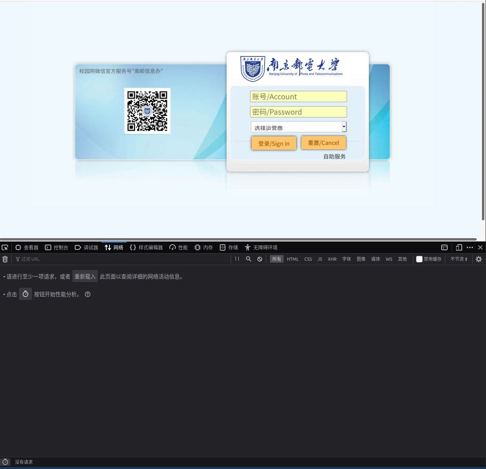

# NJUPT_Network_AutoLogin How_to

本文主要讲述这个脚本是如何写成的，以便于各位学习相关技术，并在学校更新参数导致本脚本失效时可以自行修改。写这个脚本时主要参考博客[Dr.COM校园网多设备解决方案](https://jakting.com/archives/drcom-autologin-padavan-tgbot.html)。

## 获取进行登录的请求

首先需要一个带有调试模式的浏览器，我常用的是Firefox浏览器，因此以此为例。

首先进入学校网络的登录界面[10.10.244.11](http://10.10.244.11)，然后打开工具箱(快捷键是F12)，进入其中的网络标签，此时里面内容为空。

