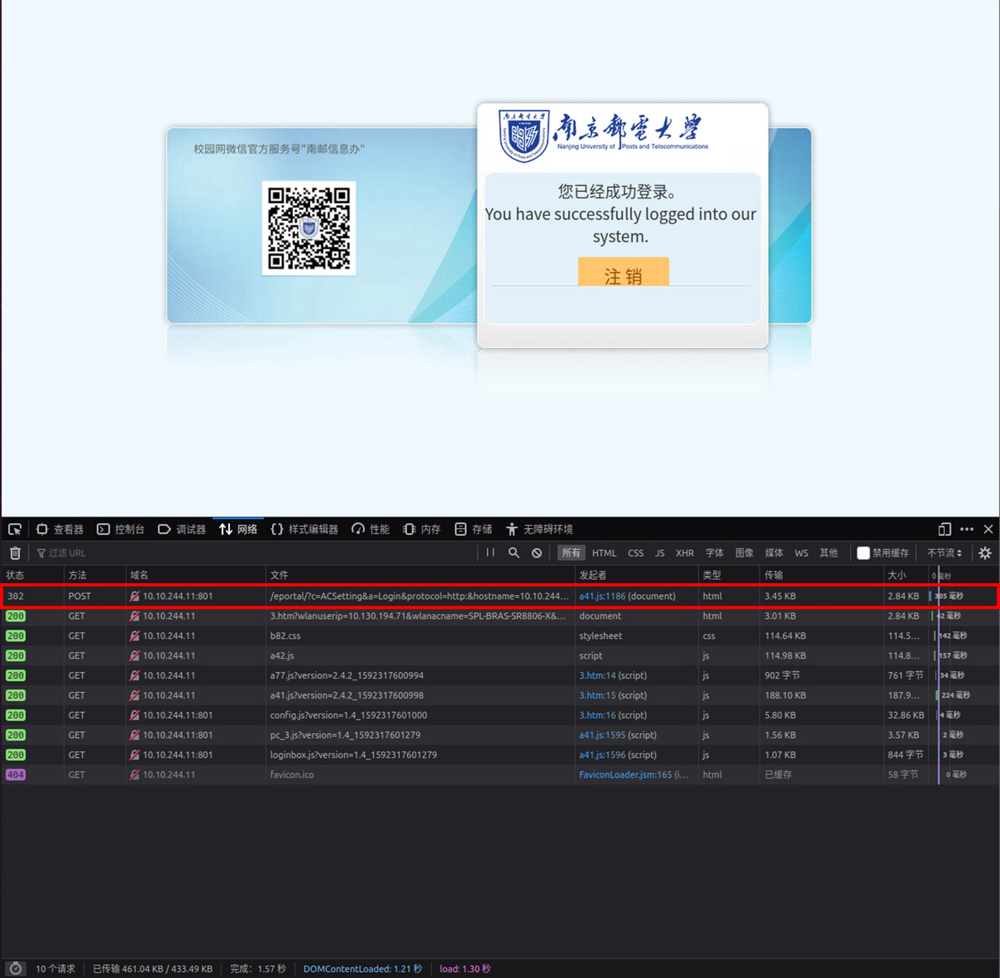
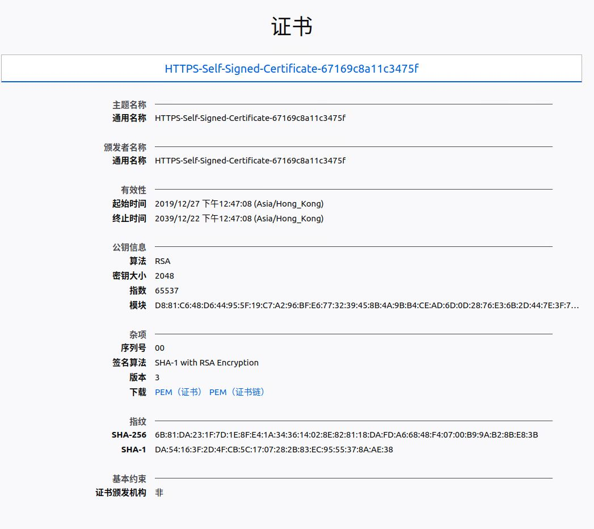

# NJUPT_Network_AutoLogin How_to

本文主要讲述这个脚本是如何写成的，以便于各位学习相关技术，并在学校更新参数导致本脚本失效时可以自行修改。写这个脚本时主要参考博客[Dr.COM校园网多设备解决方案](https://jakting.com/archives/drcom-autologin-padavan-tgbot.html)。

## 获取、分析登录的请求

首先需要一个带有调试模式的浏览器，我常用的是Firefox浏览器，因此以此为例。

首先进入学校网络的登录界面[10.10.244.11](http://10.10.244.11)，然后打开工具箱(快捷键是F12)，进入其中的网络标签，此时里面内容为空。


随后进行登录操作直到成功(根据实测经验，第一次的登录会失败，第二次才会成功)，此时网络标签显示如下：



找到第一个POST请求，点开，查看其详细参数(部分参数为虚构)：

在消息头标签页中，获取请求字符串样例如下:

`http://10.10.244.11:801/eportal/?c=ACSetting&a=Login&protocol=http:&hostname=10.10.244.11&iTermType=1&wlanuserip=10.130.194.44&wlanacip=10.255.253.118&wlanacname=SPL-BRAS-SR8806-X&mac=00-00-00-00-00-00&ip=10.130.194.44&enAdvert=0&queryACIP=0&loginMethod=1`

随后转到请求标签页，查看其查询字符串和表单数据，样例如下(以json形式列出):

查询字符串

```
{
    "c": "ACSetting",
    "a": "Login",
    "protocol": "http:",
    "hostname": "10.10.244.11",
    "iTermType": "1",
    "wlanuserip": "10.130.194.44",
    "wlanacip": "10.255.253.118",
    "wlanacname": "SPL-BRAS-SR8806-X",
    "mac": "00-00-00-00-00-00",
    "ip": "10.130.194.44",
    "enAdvert": "0",
    "queryACIP": "0",
    "loginMethod": "1"
}
```

表单数据

```
{
    "DDDDD": ",0,agagaefa@njxy",
    "upass": "dgagergawg",
    "R1": "0",
    "R2": "0",
    "R3": "0",
    "R6": "0",
    "para": "00",
    "0MKKey": "123456",
    "buttonClicked": "",
    "redirect_url": "",
    "err_flag": "",
    "username": "",
    "password": "",
    "user": "",
    "cmd": "",
    "Login": "",
    "v6ip": ""
}
```

可以在多台电脑上进行尝试，并尝试不同的运营商组合，以便找到其规律。目前我测试时找到的规律如下：

请求的URL实际为`http://10.10.244.11:801/eportal/`，表示请求的地址为`10.10.244.11`，端口为`801`，路径为`/eportal/`，后续使用`?`搭载查询字符串，格式为：`名称=数据`，使用`&`符号连接。

查询字符串中发现的规律为：

参数名称|规律
----|----
c|常数`ACSetting`
a|常数`Login`
protocol|常数`http:`
hostname|与请求地址相同
iTermType|常数`1`
wlanuserip|设备的ip地址，如果设备位于路由器后则为路由器的ip地址
wlanacip|某个地址，看似是常数，但其他项目中填的地址不同
wlanacname|某个名称(经搜索是可能是设备的型号)
mac|常数`00-00-00-00-00-00`
ip|与参数`wlanuserip`相同
enAdvert|常数`0`
queryACIP|常数`0`
loginMethod|常数`1`

表单数据为中发现的规律为：

参数名称|规律
----|----
DDDDD|与账号和运营商相关，格式为`,0,账号名`或`,0,账号名@运营商`，前者为校园网，后者为中国电信与中国移动，中国电信的字符串是`njxy`，中国移动的字符串是`cmcc`
upass|账户密码
R1|常数`0`
R2|常数`0`
R3|常数`0`
R6|常数`0`
para|常数`00`
0MKKey|常数`123456`
其余参数|空

使用`curl`(Linux环境下)发送一个POST请求的格式为

```
curl 请求URL+查询字符串 --data 表单数据
```

因此，只需要使用curl命令模拟浏览器发送一个POST请求即可达到登录的效果。可以先手动根据自己的实际情况手动构造一个请求，测试是否可行。

例如，发送上述参数的命令为：

```
curl "http://10.10.244.11:801/eportal/?c=ACSetting&a=Login&protocol=http:&hostname=10.10.244.11&iTermType=1&wlanuserip=10.130.194.44&wlanacip=10.255.253.118&wlanacname=SPL-BRAS-SR8806-X&mac=00-00-00-00-00-00&ip=10.130.194.44&enAdvert=0&queryACIP=0&loginMethod=1" --data "DDDDD=,0,agagaefa@njxy&upass=dgagergawg&R1=0&R2=0&R3=0&R6=0&para=00&0MKKey=123456&buttonClicked=&redirect_url=&err_flag=&username=&password=&user=&cmd=&Login=&v6ip="
```

## 相关参数的获取

在上述所有参数中，手动登录时需要用到的也只有账号、密码和运营商，这三者可以计算出表单数据中的`DDDDD`与`upass`参数，其他数据需要使用其他方式获得。对于`wlanacip`与`wlanacname`参数，其他项目一般设置为常数，在实际的使用中的确不会经常变动，对于`wlanuserip`参数，其他项目一般是使用本机的地址，这需要执行脚本的设备必须直接连接校园网，在实际的网络架构中一般是路由器，这限制了路由器的选择。

在一次无意的测试中，我发现了可以通过未登录时的一个强制跳转(即没有登录时，无论打开什么网页都会跳到登录界面)中得到上述参数。

在没有登录时，执行以下命令向百度发送一个Get请求：

`curl http://baidu.com`

得到的回复如下

```
<html>
<head>
<script type="text/javascript">location.href="http://10.10.244.11/a79.htm?wlanuserip=10.130.194.44&wlanacip=10.255.253.118&wlanacname=SPL-BRAS-SR8806-X"</script>
</head>
<body>
Authentication is required. Click <a href="http://10.10.244.11/a79.htm?wlanuserip=10.130.194.44&wlanacip=10.255.253.118&wlanacname=SPL-BRAS-SR8806-X">here</a> to open the authentication page.
</body>
</html>
```

其中包含了一个跳转目标URL，即

`http://10.10.244.11/a79.htm?wlanuserip=10.130.194.44&wlanacip=10.255.253.118&wlanacname=SPL-BRAS-SR8806-X`

与上述参数对比，可以得到以下参数：

+ `hostname`

+ `wlanuserip`

+ `wlanacip`

+ `wlanacname`

正好是上述使用浏览器登录时无需输入的参数。

## 判断是否需要联网

首先是时间限制，除去特殊节假日，平常的有网时间是7点到23点，周五周六晚上例外，这边用简单的条件判断即可解决，不在叙述。

随后是在可以联网时有没有连接上，普通的做法是使用ping命令测试一个ip地址，这么做当然可以，我使用的方法比较另类，即使用curl向百度(百度的最大用途还真是测试是否连上了网)发送一个Get请求。与上述参数获取方式不同的是，这次使用了https协议，即请求以加密方式发送数据，https的介绍请自行搜索。由于学校服务器并没有百度域名的证书及其私钥，因此无法伪装成百度的服务器返回数据(相比http就可以)，只能使用一个自签名证书进行强制跳转，返回数据是无法被信任的，下图是学校服务器的自签名证书。



因为证书错误，因此使用curl时建立加密连接失败，会返回错误，据此可以判断已经断网，下面是测试结果：

```
$ curl https://baidu.com
curl: (60) SSL certificate problem: self signed certificate
More details here: https://curl.haxx.se/docs/sslcerts.html

curl failed to verify the legitimacy of the server and therefore could not
establish a secure connection to it. To learn more about this situation and
how to fix it, please visit the web page mentioned above.
```

如果忽略证书错误，得到的返回值与之前一样：

```
$ curl https://baidu.com -k
<html>
<head>
<script type="text/javascript">location.href="http://10.10.244.11/a79.htm?wlanuserip=10.130.194.44&wlanacip=10.255.253.118&wlanacname=SPL-BRAS-SR8806-X"</script>
</head>
<body>
Authentication is required. Click <a href="http://10.10.244.11/a79.htm?wlanuserip=10.130.194.44&wlanacip=10.255.253.118&wlanacname=SPL-BRAS-SR8806-X">here</a> to open the authentication page.
</body>
</html>
```

## 脚本思路

通过上述的讲述，脚本的执行思路就很明朗了。首先判断是否需要联网(在可以联网时却断网了)，在要联网时首先获取登录请求的相关参数，最后发送该登录请求。以后学校更新系统时，就可以自行修改本脚本以适应了。
